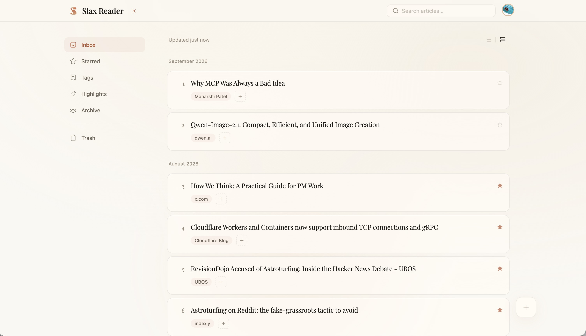

# Slax Reader

Open-source, AI-powered read-it-later — save web pages, highlight, and discuss.



## Get Slax Reader

- **Website**: [slax.com/reader](https://slax.com/reader/)
- **Web**: [r.slax.com](https://r.slax.com/)
- **iOS**: [App Store](https://apps.apple.com/us/app/slax-reader-ai-read-later/id6596730998)
- **Android**: [Google Play](https://play.google.com/store/apps/details?id=com.slax.reader)
- **Chrome Extension**: [Chrome Web Store](https://chromewebstore.google.com/detail/slax-reader/gdnhaajlomjkhahnmiijphnodkcfikfd) (works on Edge too)

Follow [@SlaxReader](https://x.com/SlaxReader) on X for updates.

## What it does

- **Permanent snapshots** — saved pages stay readable even after the original link dies.
- **AI reading aids** — outlines, summaries, and in-context answers while you read.
- **Highlight and discuss** — annotate any passage, then share the page; anyone with the link can join the discussion.

## Repository structure

This monorepo hosts all non-mobile Slax Reader code:

| Path                      | Description                                                          |
| ------------------------- | -------------------------------------------------------------------- |
| `apps/web`                | Web frontend ([r.slax.com](https://r.slax.com/))                     |
| `apps/extension`          | Browser extension (Chrome/Edge)                                      |
| `apps/api`                | API server (Cloudflare Workers: Core, Edge, AI and Browser)          |
| `apps/cli`                | Command-line client                                                  |
| `packages/contracts`      | Shared API, domain and event contracts (`@slax-reader/contracts`)    |
| `packages/frontend-types` | Shared Web/Extension implementation types                            |
| `packages/frontend-utils` | Shared frontend utilities                                            |
| `packages/selection`      | Shared highlighting and annotation engine                            |
| `deploy/`                 | Public API templates and local Web, Extension and API infrastructure |
| `docs/`                   | Web, Extension and API development documentation                     |

Shared libraries belong in `packages` when at least two apps use them. See the
[Web architecture](docs/web/architecture.md) for the current application and package boundaries.

## Development and self-hosting

Install dependencies once from the repository root:

```bash
pnpm install --frozen-lockfile
```

The root exposes one dispatcher per application while each app keeps its concrete command list:

```bash
pnpm preflight
pnpm setup:all
pnpm api -- dev
pnpm web -- dev
pnpm extension -- dev
```

`pnpm preflight` checks the Node.js/pnpm runtime and the API, Web, and Extension module states without changing local files or services. After configuration is prepared, `pnpm setup:all` runs API setup, Web setup, and Extension setup in order. Run the three `dev` commands separately; setup never starts application servers.

The API's `setup` command prepares local dependencies and exits; `dev` starts Workers separately. Use `pnpm api -- setup` when only the API needs to be initialized again. Remote deployment and migrations remain explicit operations with their safety checks. See the [API development guide](docs/api/DEVELOPMENT-DOCUMENT-EN.md) ([中文](docs/api/DEVELOPMENT-DOCUMENT-CN.md), [日本語](docs/api/DEVELOPMENT-DOCUMENT-JP.md)).

Preflight distinguishes startup blockers (`当前无法启动`) from missing functionality (`可启动，但无法正常运行`), such as unavailable Docker or missing login settings. Both return exit code 1; optional features do not. See [Reading preflight results](docs/LOCAL-SETUP.md#reading-preflight-results) for status meanings and recovery steps.

Web and Extension configuration lives alongside the API's under `deploy/local/`, distinguished by filename: `.env.web`/`.env.web.example` for Web, `.env.extension`/`.env.extension.example` for Extension. The API uses the public template [`deploy/cloudflare/api.toml.example`](deploy/cloudflare/api.toml.example) and ignored local configuration under `deploy/local/`. Secrets belong in ignored local environment files or platform secret stores; do not put them in tracked templates or browser bundles.

API commands and API-specific configuration belong to [`apps/api/`](apps/api/), including Prisma configs under `prisma/` and deployment code under `script/deploy/`. The root `api` command forwards to the scripts declared by `apps/api/package.json`. Validation commands include:

```bash
pnpm api -- gen:all
pnpm api -- lint
pnpm api -- typecheck
pnpm api -- test
pnpm api -- build
```

The API's `setup` command prepares local dependencies and exits; `dev` starts Workers separately. Remote deployment and migrations remain explicit operations with their safety checks. See the [API development guide](docs/api/DEVELOPMENT-DOCUMENT-EN.md) ([中文](docs/api/DEVELOPMENT-DOCUMENT-CN.md), [日本語](docs/api/DEVELOPMENT-DOCUMENT-JP.md)).

Shared HTTP types live in [`packages/contracts`](packages/contracts/README.md). Web, Extension, API and future CLI code imports the contract package and does not import application internals.

## Contributing

Bug reports, features, and docs are all welcome. You can contribute without a development environment through
[Web 开发与参与指南](docs/web/development.md) or [Extension development](docs/extension/development.md).
Please follow our [Code of Conduct](CODE_OF_CONDUCT.md).

## License

[Apache License 2.0](LICENSE). Copyright is held by The Slax Reader Contributors — see [NOTICE](NOTICE) for details.
