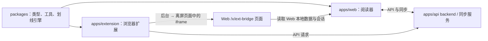

# 目录与应用关系

[文档首页](../README.md) · [参与指南](../contributing/README.md) · [Developer setup in English](../contributing/development.en.md)

`apps` 是可以启动或构建的应用，`packages` 是多个应用使用的库，`docs` 是给参与者看的说明。
Monorepo 的含义是把这些项目放在同一个仓库里协作，并不意味着它们会变成一个应用。

## 去哪里找

| 目录 | 内容 | 本次迁移状态 |
| --- | --- | --- |
| [`apps/web`](../../apps/web/README.md) | Nuxt 阅读器：页面、组件、本地同步、Web 服务端渲染 | 已迁入 |
| [`apps/extension`](../../apps/extension/README.md) | WXT 浏览器扩展：后台、网页侧边栏、离屏页面 | 已迁入 |
| [`apps/backend`](../../apps/backend) | 为 API 服务预留的位置 | 当前占位；实际 backend 仍在外部仓库 |
| [`apps/cli`](../../apps/cli) | 为命令行应用预留的位置 | 当前占位；不属于本次前端迁移 |
| [`packages/contracts`](../../packages/contracts/README.md) | 前后端共享的 API、领域数据、事件和路由契约，包名 `@slax-reader/contracts` | Web、Extension，以及后续 backend 使用 |
| [`packages/frontend-types`](../../packages/frontend-types/README.md) | Web/Extension 的浏览器端和 local-first 实现类型，包名 `@commons/frontend-types` | 两个前端 app 使用 |
| [`packages/frontend-utils`](../../packages/frontend-utils/README.md) | 现有公共工具，包名 `@commons/frontend-utils` | 两个 app 使用 |
| [`packages/selection`](../../packages/selection/README.md) | 划线和标注引擎，包名 `@slax-reader/selection` | 两个 app 使用 |
| [`docs`](../README.md) | 贡献、开发、架构和迁移记录 | 在这里查阅 |
| [`tests/e2e`](../../tests/e2e) | 为跨应用测试预留的位置 | 当前占位；已迁入的测试在各 app 的 `tests` 内 |
| [`tooling`](../../tooling) | 仓库内部工具 | 保留骨架现有职责 |
| [`deploy`](../../deploy/README.md) | 各应用的本地环境配置及公开示例 | Web 与 Extension 已接入 |

这些共享库并不是本次为凑目录抽出来的：原 Web 和扩展都已经在用。跨前后端传输的类型、API 路由和事件放在
`contracts`；只服务浏览器端实现的本地存储、扩展面板等类型放在 `frontend-types`。当前迁移仍保留少量历史
领域类型中的 local-first 可选字段，等 backend 接入后再按真实响应拆成 DTO 和本地模型。旧仓库的 `types-pro`
已并入 `contracts` 或 `frontend-types` 的对应职责，避免长期保留职责重叠的类型包；旧仓库的 `utils` 则明确改名为
`frontend-utils`，避免将来与 Backend 或 CLI 的工具库混淆。以后也是至少两个 app 使用的库才放进 `packages`，
单个 app 的专用模块留在自己的目录。

## 两个前端如何配合

共享库通过 pnpm workspace 链接，供编译时导入；Web 与扩展运行时还会通过消息和 Web 页面协作。
扩展的后台负责浏览器事件和消息，内容脚本在网页中挂载界面，离屏页面中嵌入 Web 的 `/x/ext-bridge`，
用它访问 Web 的本地书签数据与会话。仅能加载扩展，不能证明登录或收藏同步已经可用。

`apps/web/server` 属于 Nuxt 的服务端渲染和请求处理，不是迁进来的独立 backend。
本次没有移动 backend 代码，扩展 ID、消息协议、后端调用和用户功能以原快照为基准保留。
细节分别见 [Web 架构](../apps/web/architecture.md) 与 [Extension 架构](../apps/extension/architecture.md)。

## 配置和文档放在哪里

应用的 `nuxt.config.ts`、`wxt.config.ts`、`env.schema.ts` 和 `config` 都在自己的 app 内。
两端当前各有一份环境加载、UnoCSS 和 ESLint 基础配置，优先保证应用目录自洽；没有让扩展依赖 Web 的配置。
根目录只保留 workspace 编排、仓库治理和导航。
本地环境文件集中在 `deploy/local_web`、`deploy/local_extension`，由 `tooling/env-files.mjs` 为根命令和 preflight 统一加载；真实配置不纳入 Git。

贡献者长文档放在 `docs/contributing`、`docs/apps`、`docs/architecture`、`docs/migrations`。
[`apps/web/open_docs`](../../apps/web/open_docs) 是产品读取的条款、隐私等页面内容。
Nuxt 还在 [`content.config.ts`](../../apps/web/content.config.ts) 中配置了 app 内 `docs/en` 与 `docs/zh`
内容入口，但当前源码快照没有这两个目录；不要把它们误写为已经迁入的开发者文档。

`.nuxt`、`.wxt`、`.vendor`、`dist`、`build` 和 `node_modules` 是本地生成内容，不纳入 Git。
目录中已有的源码资产和类型声明则按原快照保留，具体来源见[迁移记录](../migrations/slax-reader-web-extension.md)。

## 当前能做什么

文案反馈和文档修订可以在线参与。本地类型检查、单元测试和构建已有阶段验证；
真实业务仍需要开发配置与apps/api backend。当前没有自动 PR 预览、统一一键启动器或免后端演示环境。
Xcode / `better-sqlite3` 完整安装问题与真实业务联调留在[最终验收清单](../migrations/final-verification.md)。
