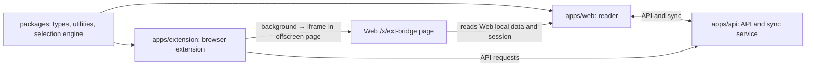

# Slax Reader Web architecture

## Overview

Slax Reader Web is a Nuxt 4 reading application. The frontend source is under `apps/web`, uses shared workspace packages, and does not depend on Git submodules. The `apps/api` service provides the runtime API and synchronization backend.

## Application relationships in the repository

`apps` contains runnable and buildable applications. `packages` contains libraries used by multiple applications. `docs/web` and `docs/extension` contain frontend development guides. A library belongs in `packages` only when at least two applications use it; app-specific implementation, configuration and tests stay under the relevant `apps` directory.

| Directory | Contents |
| --- | --- |
| `apps/web` | Nuxt reader, local-first data and Web server rendering |
| `apps/extension` | WXT browser extension, background scripts, side panel and offscreen page |
| `apps/api` | Cloudflare Workers API service |
| `packages/contracts` | API, domain and event contracts shared by Web, Extension, API and CLI |
| `packages/frontend-types` | Browser and local-first implementation types shared by Web and Extension |
| `packages/frontend-utils` | Frontend utilities shared by Web and Extension |
| `packages/selection` | Shared highlighting and annotation engine |
| `deploy` | Local application configuration and public templates |



Web and Extension import shared packages through the workspace. At runtime, the Extension offscreen page uses Web's `/x/ext-bridge` to access browser-side local data and session state. API business logic belongs in `apps/api`, not in either frontend application's server directory.

## Project structure

```
apps/web/
├── app/                            # Nuxt 4 app directory
│   ├── assets/
│   │   └── styles/                 # product theme tokens
│   ├── components/
│   │   ├── Article/
│   │   │   ├── BookmarkArticleLocalFirst.vue  # local-first article view
│   │   │   └── Selection/          # text selection interactions
│   │   ├── BookmarkList/
│   │   ├── Chat/                   # AI chat
│   │   ├── Collection/             # collection management UI
│   │   ├── Dashboard/              # dashboard charts
│   │   ├── Login/                  # login banners and related UI
│   │   ├── Snapshot/               # snapshot page extensions
│   │   └── global/                 # globally auto-registered components
│   ├── composables/
│   │   ├── bookmark/               # bookmark features
│   │   ├── useLocalFirst.ts        # local-first data bridge
│   │   ├── useDashboardMetrics.ts  # dashboard metrics
│   │   ├── useSubscribeChecking.ts # subscription status checks
│   │   └── ...
│   ├── local-first/
│   │   ├── connector.ts            # PowerSync connector
│   │   └── schema.ts               # local SQLite schema
│   ├── middleware/
│   ├── pages/
│   │   ├── [blogger]-reader/       # public blogger reader
│   │   ├── b/[id].vue              # bookmark article detail
│   │   ├── bookmarks/              # bookmark list
│   │   ├── c/[id]/                 # collection page
│   │   ├── dashboard/              # data dashboard
│   │   ├── login.vue
│   │   └── subscription/           # subscription and payment pages
│   ├── plugins/
│   │   ├── powersync.client.ts     # PowerSync initialization
│   │   ├── local-first-adapters.client.ts
│   │   ├── dashboard-metric.client.ts
│   │   └── pinia.ts
│   ├── service-worker/             # PWA service worker
│   └── utils/
├── server/                         # Nitro / Cloudflare Worker server logic
├── tests/                          # Vitest tests
├── i18n/                           # internationalization configuration
├── public/                         # static assets
├── nuxt.config.ts                  # build configuration and environment profiles
├── wrangler.toml                   # Cloudflare Workers deployment configuration
└── package.json
```

## Technology stack

### Core framework

- **Nuxt 4** (Vue 3) + **Vite** — full-stack framework with a Cloudflare Workers preset
- **PowerSync** (`@powersync/vue` + `@powersync/web`) — local-first offline synchronization using SQLite
- **Pinia** + `pinia-plugin-persistedstate` — state management
- **VueUse** — composition utilities
- **Vite-PWA** — PWA and service worker support

### Feature libraries

- **@nuxt/content** — content pages such as documentation and blog pages
- **nuxt-og-image** + **satori** — dynamic OG image generation
- **Stripe** (`@stripe/stripe-js`) — payment integration
- **Firebase** — push notifications and related services
- **Markmap** — mind-map rendering
- **KaTeX** — mathematical formulas
- **virtua** — virtual lists
- **canvas-confetti** — visual effects

### Deployment and build

- **Cloudflare Pages + Workers** — production deployment
- **Wrangler** — Workers CLI and local development
- **UnoCSS** — utility-first CSS

## Development guide

Commands, environment configuration, participation and submission workflow are in the [Web development guide](development.md).
The `server` directory belongs to Nuxt; API business services live in `apps/api` and communicate through service bindings and HTTP APIs.

### Environment profiles

`nuxt.config.ts` maintains an `ENV_PROFILES` table selected by `SLAX_ENV`:

| `SLAX_ENV` | Purpose | minify | sourcemap |
| --- | --- | --- | --- |
| `development` | Local development | no | yes |
| `preview` | Test environment | no | yes |
| `beta` | Beta environment | yes | yes |
| `production` | Production | yes | no |

## Internationalization

The project uses `@nuxtjs/i18n` (based on vue-i18n).

Avoid string concatenation; use interpolation:

```javascript
// Configuration: "{tips} is loading"
t('{tips} is loading...', { tips: 'the list' })
```

In dynamic components, obtain the translation function with:

```javascript
const t = (text: string) => useNuxtApp().$i18n.t(text)
```

Use these key naming patterns:

```
page.[page-file-name].[description]       // page.auth.title
component.[component-name].[description]  // component.login_view.title
util.[utility-name].[description]         // util.request.error
common.[category].[description]           // common.tips.success
```

## Debugging entry points

When generated type hints are missing, run `pnpm --filter @apps/slax-reader-dweb type`.
After changing `packages/selection/src`, run `pnpm --filter @slax-reader/selection build`, or use an app command that prepares it automatically.
Debug local synchronization with a development account. Clearing IndexedDB can remove unsynchronized data, so confirm synchronization first.

## License

See the repository [LICENSE](../../LICENSE) and [NOTICE](../../NOTICE).

[Chinese documentation](architecture_CN.md) · [Web development](development.md)
